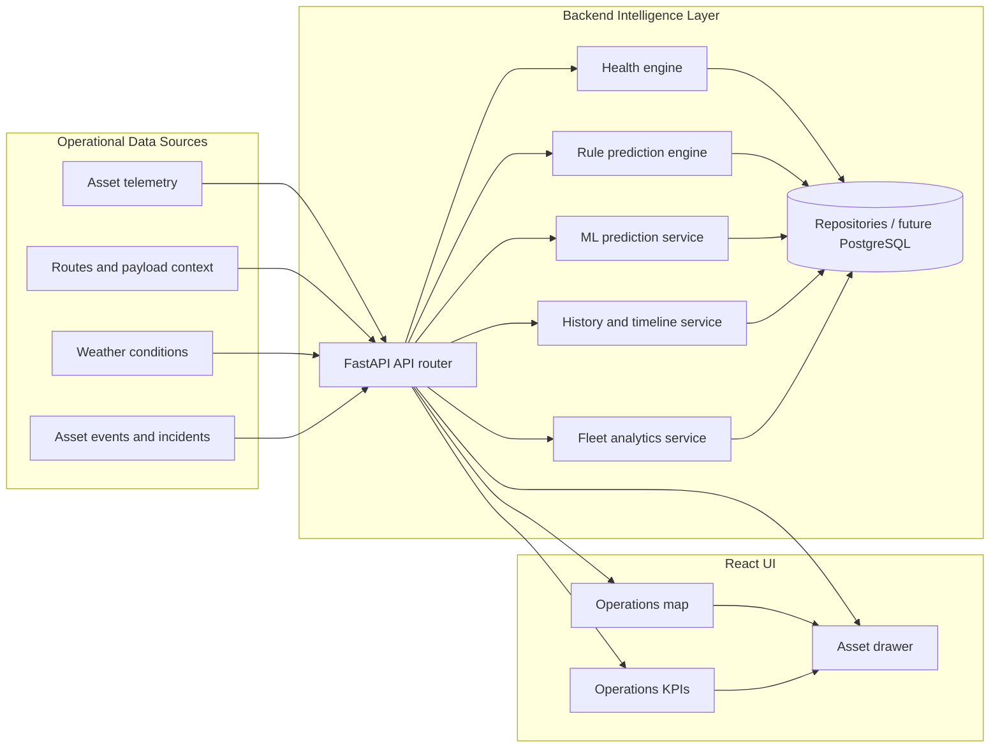

# Equipment Guardian

Equipment Guardian is an AI-powered mining equipment intelligence platform.

The platform is organized around mining assets rather than a single equipment class. Haul truck tire overheating prediction is the first implementation target, with the repository shaped so excavators, drills, dozers, graders, and future intelligence domains can be added without changing core platform assumptions.

## One-Page Architecture



### Data Flow

1. Asset and operational data enters the backend through repository-backed services.
2. The health engine evaluates current condition, active alerts, and risk level.
3. The rule-based prediction engine and the ML prediction service produce near-term failure risk.
4. The history service builds timeline entries, telemetry history, and prediction explanations.
5. The analytics service aggregates fleet trends such as predicted failures, health trends, and downtime avoided.
6. The React frontend fetches those API responses and renders the map, KPI cards, and asset drawer.
7. The asset drawer is where operators inspect health, predictions, timeline events, and recommended actions.

### End-to-End App Flow

This is the runtime flow a new engineer should keep in mind:

1. User opens the dashboard in the frontend (`AssetsPage`) and the app requests fleet data.
2. Frontend calls backend APIs (`/api/assets`, `/api/health`, `/api/alerts`, `/api/predictions`, `/api/ml/predictions`, `/api/analytics/fleet`).
3. Backend reads current asset state from storage repositories and evaluates health/risk.
4. Prediction layer produces:
	- Rule-based event prediction and recommended action.
	- ML probability/confidence for tire-overheat risk.
5. Storage layer builds historical intelligence:
	- Asset timeline events (`/api/assets/{id}/timeline`).
	- Prediction explanation context (`/api/assets/{id}/history`).
6. Backend returns normalized JSON contracts to frontend services/hooks.
7. Frontend renders:
	- Operations map with risk and prediction badges.
	- Asset drawer with health, predictions, timeline, and explanations.
	- KPI cards with fleet analytics trends.
8. If user opens Copilot and asks a question, frontend posts to `/api/copilot/chat`.
9. Intelligence layer gathers platform context (asset, health, predictions, timeline, analytics) and returns a data-grounded response.
10. Copilot panel displays the assistant response in the conversation stream.

In short: `UI -> API -> health/prediction/storage/intelligence -> API response -> UI`.

## Repository Layout

- `frontend/` - React, TypeScript, Vite application shell.
- `backend/` - FastAPI service, domain modules, persistence, and prediction-engine interfaces.
- `shared/` - Shared contracts and schemas used across services.
- `data/` - Local development data staging for assets, routes, weather, and events.
- `ml/` - Asset and maintenance-specific machine learning workspaces.
- `docs/` - Architecture, roadmap, data-contract, and AI-strategy documentation.
- `infra/` - Docker and infrastructure configuration.
- `scripts/` - Developer automation and maintenance scripts.

## Principles

- Build around assets, not trucks.
- Keep asset types extensible.
- Keep prediction engines pluggable.
- Isolate AI agents by domain.
- Treat shared contracts as the source of truth.

## Getting Started

This scaffold does not implement business logic yet.

```bash
docker compose up --build
```
