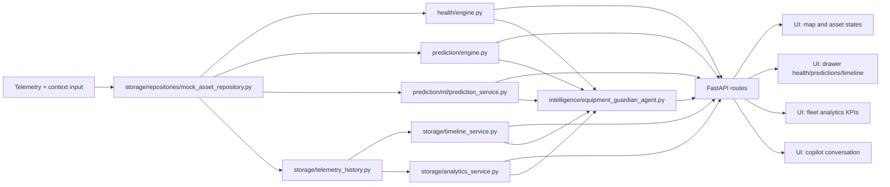

# Data Flow

This document describes the runtime pipeline from telemetry ingestion to UI rendering.

## End-to-End Flow

## Processing Sequence

1. Telemetry and operational context are loaded via the storage repository layer.
2. Health rules compute risk level, health score, and active alerts.
3. Prediction engine computes rule-based event risk and recommended action.
4. ML inference computes probability and confidence from engineered features.
5. Historical telemetry is used to assemble timeline events and prediction explanation context.
6. Fleet analytics aggregates trends such as predicted failures and downtime avoided.
7. Copilot intelligence composes answers strictly from platform data.
8. API routes return composed responses to the React frontend.
9. UI renders map badges, drawer details, KPI panels, and copilot conversations.

## API Touchpoints

- `/api/assets` and `/api/assets/{id}`: asset details and current telemetry.
- `/api/health`: fleet health state.
- `/api/alerts`: active alert projections.
- `/api/predictions` and `/api/predictions/{id}`: rule predictions.
- `/api/ml/predictions` and `/api/ml/predictions/{id}`: ML predictions.
- `/api/assets/{id}/history`: prediction explanation context.
- `/api/assets/{id}/timeline`: timeline events.
- `/api/analytics/fleet`: fleet trends and operational impact metrics.
- `/api/copilot/chat`: operational intelligence assistant responses.
